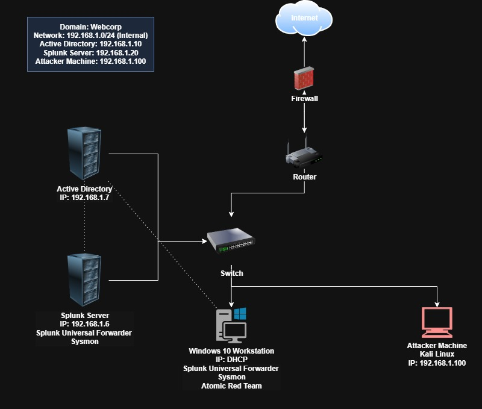

# Active Directory Security Lab

A comprehensive security lab environment featuring Active Directory, Splunk monitoring, and security testing capabilities.

## Network Diagram

*Network diagram showing the complete lab infrastructure with Active Directory, Splunk, and testing environment*

## Environment Overview

- **Domain**: Webcorp
- **Network**: 192.168.1.0/24 (Internal)
- **Components**:
  - Active Directory (192.168.1.7)
  - Splunk Server (192.168.1.6)
  - Windows 10 Workstation (DHCP)
  - Kali Linux Machine (192.168.1.100)

## Features

- Fully configured Active Directory environment
- Splunk monitoring with Universal Forwarder
- Network segmentation with firewall
- Security testing environment

## Prerequisites

- VMware/VirtualBox
- Minimum 16GB RAM recommended
- 250GB available storage
- Windows Server ISO
- Windows 10 ISO
- Kali Linux ISO
