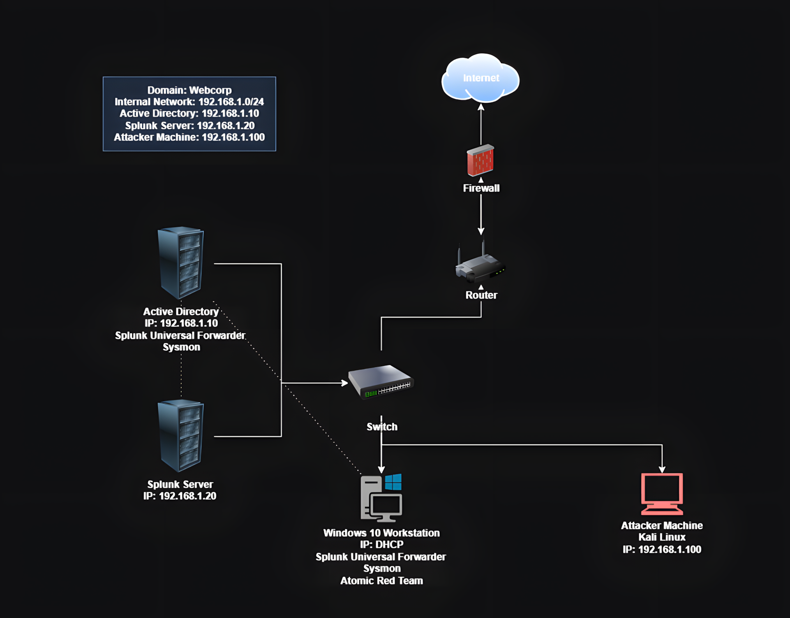

# Active Directory Security Lab

A comprehensive security lab environment featuring Active Directory, Splunk monitoring, and security testing capabilities.

## Network Diagram

## Environment Overview

- **Domain**: Webcorp
- **Internal Network**: 192.168.1.0/24 
- **Components**:
  - Active Directory (192.168.1.10)
  - Splunk Server (192.168.1.20)
  - Windows 10 Workstation (DHCP)
  - Kali Linux Machine (192.168.1.100)

## Features

- Fully configured Active Directory environment
- Splunk monitoring with Universal Forwarder
- Network segmentation with firewall
- Security testing environment

## Prerequisites

- VMware/VirtualBox
- Minimum 16GB RAM recommended
- 250GB available storage
- Windows Server 2022 ISO [>url](https://www.microsoft.com/en-us/evalcenter/evaluate-windows-server-2022)
- Ubuntu Server ISO [>url](https://ubuntu.com/download/server)
- Windows 10 ISO [>url](https://www.microsoft.com/en-ca/software-download/windows10)
- Kali Linux ISO [>url](https://www.kali.org/get-kali/#kali-installer-images)
